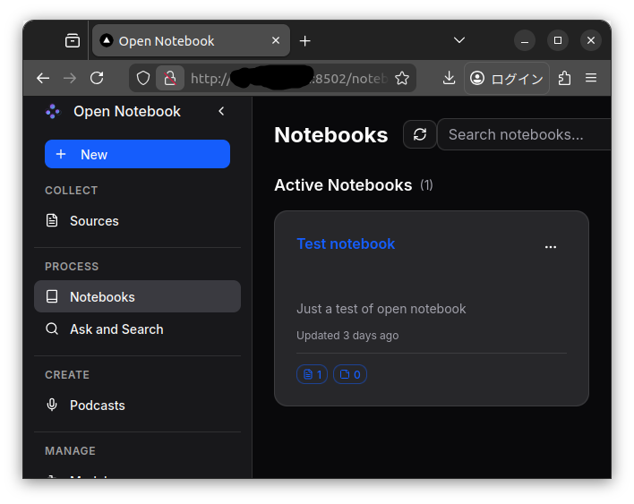

# Open Notebook - Learning Project

## About This Repository

This repository is entirely based on and owes everything to the amazing [Open Notebook](https://github.com/lfnovo/open-notebook) project by [lfnovo](https://github.com/lfnovo).

**The sole purpose of this repository is to learn how to use Open Notebook.**

## Credits and Appreciation

All credit goes to the original [Open Notebook project](https://github.com/lfnovo/open-notebook). This is an incredible tool that deserves recognition for its innovation and utility. I am deeply grateful to the creator and contributors for making such a valuable resource available to the community.

Please visit the [original repository](https://github.com/lfnovo/open-notebook) for:
- Complete documentation
- Latest updates and features
- Contributing guidelines
- Support and community discussions

## Modifications in This Fork

This repository contains minor modifications to run Open Notebook in a specific environment:
- Configured to run via remote SSH access
- Docker Compose configuration adjusted for remote accessibility
- Binding configuration updated to allow access from remote machines

## Usage

Suppose you are using PC "A" which is accessed remotely from PC "B".

This example assumes you are using Anthropic Claude for the language model and OpenAI for the embedding model.

1. Connect to "A" from "B" via SSH
1. Clone this repository on "A"
1. Copy `.env.example` to `.env` and add your Anthropic API key and OpenAI API key
1. Run `docker compose up -d`
1. Set up an SSH tunnel for port 8502 (this is easy if you use Remote-SSH with VSCode)
1. Access the web interface at `http://<ip-address-of-A>:8502`

---

Please refer to the [original Open Notebook documentation](https://github.com/lfnovo/open-notebook) for comprehensive usage instructions.

## License

This project follows the same license as the original Open Notebook project. Please see the [original repository](https://github.com/lfnovo/open-notebook) for license details.

---

**Thank you to the Open Notebook team for creating such an outstanding project!**

---

*This README was generated with assistance from Claude.*
